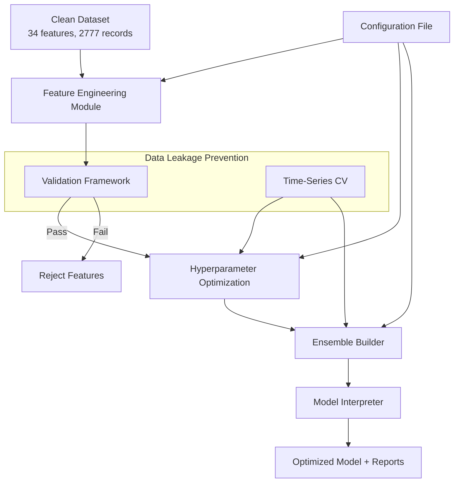

# Design Document: ML Model Optimization

## Overview

This design specifies a comprehensive machine learning optimization pipeline for the DWTS prediction project. The system builds upon the current clean baseline (Judge R² 68.77%, Fan R² 67.60%, 34 features, 2777 records) to achieve realistic performance improvements (target: 70-75% R²) through legitimate ML techniques while preventing data leakage.

The architecture follows a modular pipeline design with five core components:
1. **Advanced Feature Engineering** - Creates new features without data leakage
2. **Hyperparameter Optimization** - Systematically tunes model parameters
3. **Ensemble Methods** - Combines multiple models for better predictions
4. **Validation Framework** - Ensures data integrity through rigorous testing
5. **Model Interpretation** - Provides insights through SHAP values and feature importance

The system uses time-series aware cross-validation throughout to prevent future information leakage, and validates all features against strict correlation thresholds (< 0.85 with target).

## Architecture

### System Architecture Diagram



### Component Interaction Flow

1. **Configuration Loading**: System loads parameters from config file
2. **Feature Engineering**: Creates new features from clean dataset
3. **Validation**: Checks all features for data leakage (correlation < 0.85, lag >= 1)
4. **Hyperparameter Tuning**: Optimizes parameters using time-series CV
5. **Ensemble Building**: Combines optimized models with stacking/voting/weighting
6. **Interpretation**: Generates SHAP values and feature importance
7. **Output**: Saves optimized model and comprehensive reports

## Components and Interfaces

### 1. Feature Engineering Module

**Purpose**: Create advanced features without data leakage

**Class**: `AdvancedFeatureEngineer`

**Key Methods**:
```python
def create_polynomial_features(X: pd.DataFrame, degree: int, 
                               allowed_features: List[str]) -> pd.DataFrame:
    """
    Create polynomial features up to specified degree.
    Only uses features in allowed_features list (external + historical).
    Returns: DataFrame with original + polynomial features
    """

def create_interaction_features(X: pd.DataFrame, 
                                max_depth: int,
                                correlation_threshold: float = 0.85) -> pd.DataFrame:
    """
    Create interaction features (products of feature pairs/triples).
    Validates correlation with target < threshold.
    Returns: DataFrame with original + interaction features
    """

def create_domain_features(X: pd.DataFrame) -> pd.DataFrame:
    """
    Create domain-specific features for DWTS:
    - Week momentum: (score_lag_1 - score_lag_2) / score_lag_2
    - Consistency: rolling std of historical scores
    - Relative performance: score vs season average
    - Elimination pressure: weeks until typical elimination
    Returns: DataFrame with original + domain features
    """

def select_features(X: pd.DataFrame, y: pd.Series, 
                   method: str = 'mutual_info') -> List[str]:
    """
    Select most important features using time-series aware methods.
    Methods: 'mutual_info', 'recursive', 'lasso'
    Returns: List of selected feature names
    """
```

**Feature Categories**:
- **Polynomial**: Week², Week³, Age², Week×Age (degree 2-3)
- **Interaction**: Week×score_lag_1, Age×hist_mean, Week×n_competitors
- **Domain-specific**: momentum, consistency, relative_performance, elimination_pressure
- **Selection**: Top 50-60 features by mutual information or recursive elimination

**Validation Rules**:
- All input features must be external or historical (lag >= 1)
- All output features must have correlation with target < 0.85
- No features derived from current target values


### 2. Hyperparameter Optimization Module

**Purpose**: Systematically tune model hyperparameters

**Class**: `HyperparameterOptimizer`

**Key Methods**:
```python
def optimize_model(model_type: str, X: pd.DataFrame, y: pd.Series,
                  search_method: str = 'bayesian',
                  cv_splits: int = 5) -> Tuple[Dict, float]:
    """
    Optimize hyperparameters for specified model type.
    Uses time-series CV for validation.
    Returns: (best_params, best_score)
    """

def grid_search(model_type: str, param_grid: Dict,
               X: pd.DataFrame, y: pd.Series) -> Dict:
    """
    Exhaustive grid search over parameter space.
    Returns: best parameters
    """

def random_search(model_type: str, param_distributions: Dict,
                 n_iter: int, X: pd.DataFrame, y: pd.Series) -> Dict:
    """
    Random search over parameter distributions.
    Returns: best parameters
    """

def bayesian_optimize(model_type: str, param_space: Dict,
                     n_calls: int, X: pd.DataFrame, y: pd.Series) -> Dict:
    """
    Bayesian optimization using scikit-optimize.
    Returns: best parameters
    """
```

**Supported Models**:
1. **Random Forest**: n_estimators, max_depth, min_samples_split, min_samples_leaf
2. **Gradient Boosting**: n_estimators, learning_rate, max_depth, subsample
3. **Ridge Regression**: alpha, solver
4. **Lasso Regression**: alpha, max_iter
5. **ElasticNet**: alpha, l1_ratio

**Search Spaces**:
```python
PARAM_SPACES = {
    'random_forest': {
        'n_estimators': (100, 500),
        'max_depth': (5, 30),
        'min_samples_split': (2, 20),
        'min_samples_leaf': (1, 10)
    },
    'gradient_boosting': {
        'n_estimators': (100, 500),
        'learning_rate': (0.01, 0.3),
        'max_depth': (3, 10),
        'subsample': (0.6, 1.0)
    },
    'ridge': {
        'alpha': (0.01, 100.0)
    },
    'lasso': {
        'alpha': (0.001, 10.0)
    },
    'elasticnet': {
        'alpha': (0.001, 10.0),
        'l1_ratio': (0.0, 1.0)
    }
}
```

**Optimization Strategy**:
- Use Bayesian optimization for expensive models (Random Forest, Gradient Boosting)
- Use grid search for simple models (Ridge, Lasso, ElasticNet)
- Always use time-series CV for validation
- Track optimization history for convergence analysis


### 3. Ensemble Builder Module

**Purpose**: Combine multiple models for improved predictions

**Class**: `EnsembleBuilder`

**Key Methods**:
```python
def build_stacking_ensemble(base_models: List[Tuple[str, Any]],
                           meta_model: Any,
                           X: pd.DataFrame, y: pd.Series) -> Any:
    """
    Build stacking ensemble with time-series CV for meta-features.
    Returns: Trained stacking ensemble
    """

def build_voting_ensemble(models: List[Tuple[str, Any]],
                         voting: str = 'soft',
                         weights: List[float] = None) -> Any:
    """
    Build voting ensemble (hard or soft voting).
    Returns: Trained voting ensemble
    """

def build_weighted_ensemble(models: List[Tuple[str, Any]],
                           X: pd.DataFrame, y: pd.Series) -> Tuple[Any, List[float]]:
    """
    Build weighted ensemble with CV-based weights.
    Weights determined by inverse validation error.
    Returns: (ensemble, weights)
    """

def evaluate_ensemble(ensemble: Any, X_test: pd.DataFrame, 
                     y_test: pd.Series) -> Dict[str, float]:
    """
    Evaluate ensemble on test data.
    Returns: Dict with R², MAE, RMSE
    """
```

**Ensemble Architectures**:

1. **Stacking Ensemble**:
   - Base models: Random Forest, Gradient Boosting, Ridge, Lasso, ElasticNet
   - Meta-model: Ridge Regression (linear combination of base predictions)
   - Training: Use time-series CV to generate meta-features (avoid overfitting)

2. **Voting Ensemble**:
   - Models: Same as stacking base models
   - Voting: Soft voting (average predicted probabilities/values)
   - Weights: Optional, can be uniform or CV-based

3. **Weighted Ensemble**:
   - Models: Same as stacking base models
   - Weights: Computed as w_i = (1 / error_i) / sum(1 / error_j)
   - Error metric: RMSE from time-series CV

**Ensemble Selection Strategy**:
- Train all three ensemble types
- Compare performance on validation set
- Select best performing ensemble
- If ensemble doesn't beat best base model, use base model instead


### 4. Time-Series Cross-Validation Module

**Purpose**: Provide time-series aware CV to prevent data leakage

**Class**: `TimeSeriesCV`

**Key Methods**:
```python
def split(X: pd.DataFrame, n_splits: int = 5,
         strategy: str = 'expanding') -> Iterator[Tuple[np.ndarray, np.ndarray]]:
    """
    Generate time-series CV splits.
    Strategy: 'expanding' (growing train set) or 'sliding' (fixed size window)
    Yields: (train_indices, val_indices) for each fold
    """

def validate_temporal_order(X: pd.DataFrame, 
                           train_idx: np.ndarray,
                           val_idx: np.ndarray) -> bool:
    """
    Verify that all training data precedes validation data.
    Returns: True if valid, False otherwise
    """

def cross_val_score(model: Any, X: pd.DataFrame, y: pd.Series,
                   n_splits: int = 5) -> np.ndarray:
    """
    Compute cross-validation scores using time-series splits.
    Returns: Array of scores for each fold
    """
```

**Split Strategy**:

Expanding Window (default):
```
Fold 1: Train [S1-S20] → Val [S21-S24]
Fold 2: Train [S1-S24] → Val [S25-S28]
Fold 3: Train [S1-S28] → Val [S29-S32]
Fold 4: Train [S1-S32] → Val [S33-S34]
```

Where S = Season number (34 total seasons)

**Validation Rules**:
- Training data must always precede validation data chronologically
- No shuffling of data (preserves temporal order)
- Minimum training size: 60% of data
- Minimum validation size: 10% of data

### 5. Validation Framework Module

**Purpose**: Ensure no data leakage through rigorous testing

**Class**: `ValidationFramework`

**Key Methods**:
```python
def check_feature_correlation(X: pd.DataFrame, y: pd.Series,
                              threshold: float = 0.85) -> Dict[str, float]:
    """
    Check correlation of all features with target.
    Returns: Dict mapping feature names to correlation values
    """

def check_future_leakage(X: pd.DataFrame, 
                        feature_metadata: Dict) -> List[str]:
    """
    Check if any features use future information (lag < 1).
    Returns: List of features with potential leakage
    """

def check_target_leakage(X: pd.DataFrame, y: pd.Series,
                        feature_definitions: Dict) -> List[str]:
    """
    Check if any features are derived from current target.
    Returns: List of features with target leakage
    """

def validate_cv_splits(cv_splits: List[Tuple], 
                      X: pd.DataFrame) -> bool:
    """
    Validate that CV splits respect temporal ordering.
    Returns: True if valid, False otherwise
    """

def generate_validation_report(X: pd.DataFrame, y: pd.Series,
                              feature_metadata: Dict) -> pd.DataFrame:
    """
    Generate comprehensive validation report.
    Returns: DataFrame with feature name, correlation, lag, leakage status
    """
```

**Validation Checks**:

1. **Correlation Check**: All features must have |correlation| < 0.85 with target
2. **Future Leakage Check**: All historical features must use lag >= 1
3. **Target Leakage Check**: No features derived from current target values
4. **CV Split Check**: Training data always precedes validation data
5. **Feature/Sample Ratio**: Should be < 0.05 (avoid overfitting)

**Validation Report Format**:
```
Feature Name | Correlation | Lag | Leakage Status | Pass/Fail
-------------|-------------|-----|----------------|----------
Week         | 0.42        | N/A | None           | PASS
score_lag_1  | 0.71        | 1   | None           | PASS
score_lag_0  | 0.95        | 0   | Future         | FAIL
```


### 6. Model Interpretation Module

**Purpose**: Provide interpretability through SHAP and feature importance

**Class**: `ModelInterpreter`

**Key Methods**:
```python
def compute_shap_values(model: Any, X: pd.DataFrame,
                       sample_size: int = 100) -> np.ndarray:
    """
    Compute SHAP values for model predictions.
    Uses TreeExplainer for tree models, KernelExplainer for others.
    Returns: SHAP values array
    """

def get_feature_importance(model: Any, 
                          feature_names: List[str]) -> pd.DataFrame:
    """
    Get feature importance from tree-based models.
    Returns: DataFrame with feature names and importance scores
    """

def plot_shap_summary(shap_values: np.ndarray, X: pd.DataFrame,
                     output_path: str) -> None:
    """
    Create SHAP summary plot showing feature importance.
    Saves plot to output_path.
    """

def plot_partial_dependence(model: Any, X: pd.DataFrame,
                           features: List[str],
                           output_path: str) -> None:
    """
    Create partial dependence plots for top features.
    Saves plot to output_path.
    """

def generate_interpretation_report(model: Any, X: pd.DataFrame,
                                  feature_names: List[str]) -> Dict:
    """
    Generate comprehensive interpretation report.
    Returns: Dict with SHAP values, feature importance, top features
    """
```

**Interpretation Outputs**:

1. **SHAP Summary Plot**: Shows feature importance across all predictions
2. **Feature Importance Table**: Ranks features by importance score
3. **Partial Dependence Plots**: Shows relationship between top 5 features and predictions
4. **SHAP Waterfall Plot**: Explains individual predictions

**Computational Efficiency**:
- Use sample of 100-200 instances for SHAP computation (representative sample)
- Use TreeExplainer for tree models (fast, exact)
- Use KernelExplainer for linear models (slower, approximate)

## Data Models

### Input Data Model

**Clean Dataset** (from Phase 3):
```python
{
    'Season': int,           # Season number (1-34)
    'Week': int,             # Week number (1-11)
    'Name': str,             # Celebrity name
    'Age': int,              # Celebrity age
    'Judge_Avg_Score': float,  # Average judge score (target 1)
    'Fan_Vote_Pct': float,   # Fan vote percentage (target 2)
    'score_lag_1': float,    # Previous week score
    'score_lag_2': float,    # Score from 2 weeks ago
    'hist_mean': float,      # Historical mean score
    'hist_std': float,       # Historical std score
    'n_competitors': int,    # Number of competitors
    # ... 34 total features
}
```

**Feature Metadata**:
```python
{
    'feature_name': str,
    'category': str,  # 'external', 'historical', 'engineered'
    'lag': int,       # Lag value for historical features (0 = current)
    'source_features': List[str],  # Features used to create this feature
    'correlation_with_judge': float,
    'correlation_with_fan': float
}
```

### Configuration Model

**Optimization Configuration**:
```python
{
    'feature_engineering': {
        'polynomial_degree': int,  # 2 or 3
        'interaction_depth': int,  # 2 or 3
        'selection_method': str,   # 'mutual_info', 'recursive', 'lasso'
        'n_features_to_select': int  # 50-60
    },
    'hyperparameter_optimization': {
        'search_method': str,  # 'grid', 'random', 'bayesian'
        'n_iter': int,         # Number of iterations
        'cv_splits': int,      # 3-5
        'param_spaces': Dict   # Model-specific parameter spaces
    },
    'ensemble': {
        'base_models': List[str],  # ['rf', 'gb', 'ridge', 'lasso', 'elasticnet']
        'ensemble_types': List[str],  # ['stacking', 'voting', 'weighted']
        'meta_model': str      # 'ridge' for stacking
    },
    'validation': {
        'correlation_threshold': float,  # 0.85
        'min_lag': int,        # 1
        'test_seasons': int    # 2 (last 2 seasons for final test)
    }
}
```

### Output Data Model

**Optimization Results**:
```python
{
    'baseline_performance': {
        'judge_r2': float,
        'fan_r2': float,
        'judge_mae': float,
        'fan_mae': float
    },
    'optimized_performance': {
        'judge_r2': float,
        'fan_r2': float,
        'judge_mae': float,
        'fan_mae': float,
        'improvement_judge': float,  # Percentage improvement
        'improvement_fan': float
    },
    'best_model': {
        'type': str,  # 'stacking', 'voting', 'weighted', or single model
        'hyperparameters': Dict,
        'feature_count': int,
        'selected_features': List[str]
    },
    'validation_report': {
        'max_correlation': float,
        'leakage_detected': bool,
        'suspicious_features': List[str]
    },
    'interpretation': {
        'top_features': List[Tuple[str, float]],  # (feature, importance)
        'shap_values_path': str,
        'pdp_plots_path': str
    }
}
```


## Correctness Properties

*A property is a characteristic or behavior that should hold true across all valid executions of a system—essentially, a formal statement about what the system should do. Properties serve as the bridge between human-readable specifications and machine-verifiable correctness guarantees.*

### Property 1: Feature Input Validation

*For any* polynomial or interaction feature creation operation, all input features must be from the allowed set (external or historical features with lag >= 1), ensuring no data leakage through feature engineering.

**Validates: Requirements 1.1, 1.3**

### Property 2: Correlation Threshold Enforcement

*For any* newly created feature, if its absolute correlation with the target exceeds 0.85, the system must reject that feature and log a warning, preventing data leakage from highly correlated features.

**Validates: Requirements 1.2, 1.6, 5.1**

### Property 3: Temporal Ordering in Cross-Validation

*For any* cross-validation split generated by the system (in hyperparameter tuning, ensemble building, or validation), all training data indices must correspond to time points that precede all validation data indices, ensuring no future information leaks into training.

**Validates: Requirements 2.1, 3.4, 4.1, 4.2, 5.6**

### Property 4: Historical Feature Lag Validation

*For any* historical feature used in the system, the lag value must be >= 1, ensuring that only past information is used and no current-period data leaks into features.

**Validates: Requirements 1.3, 5.3**

### Property 5: Bayesian Optimization History Tracking

*For any* Bayesian optimization run, the system must record the parameter configuration and performance score for each iteration, enabling convergence analysis and reproducibility.

**Validates: Requirements 2.3**

### Property 6: Ensemble Weight Computation

*For any* weighted ensemble, the weights must be computed as the inverse of each model's validation error normalized to sum to 1, ensuring that better-performing models receive higher weights.

**Validates: Requirements 3.3**

### Property 7: Stacking Meta-Feature Generation

*For any* stacking ensemble, meta-features must be generated using time-series cross-validation on the training set, ensuring the meta-model doesn't overfit to training predictions.

**Validates: Requirements 3.4**

### Property 8: Test Set Isolation

*For any* ensemble or model evaluation, the test set (last 2 seasons) must never be used during training, hyperparameter tuning, or validation, only for final performance measurement.

**Validates: Requirements 3.5, 7.6**

### Property 9: Expanding Window Strategy

*For any* time-series CV with expanding window strategy, the training set size must monotonically increase with each fold while maintaining temporal ordering.

**Validates: Requirements 4.4**

### Property 10: Cross-Validation Metrics Aggregation

*For any* cross-validation run, the system must compute and report both the mean and standard deviation of performance metrics across all folds, providing insight into model stability.

**Validates: Requirements 4.6**

### Property 11: SHAP Value Completeness

*For any* final model interpretation, SHAP values must be computed for all features in the model using a representative sample of at least 100 instances.

**Validates: Requirements 6.1, 6.4**

### Property 12: Feature Importance Extraction

*For any* tree-based model, the system must extract and rank feature importance scores for all features, enabling interpretation of model decisions.

**Validates: Requirements 6.2**

### Property 13: Pipeline Execution Order

*For any* full pipeline execution, the steps must execute in this exact order: data loading → feature engineering → validation → hyperparameter tuning → ensemble building → interpretation → reporting, ensuring proper data flow and preventing leakage.

**Validates: Requirements 8.3**


## Error Handling

### Feature Engineering Errors

**High Correlation Detection**:
- **Error**: Feature correlation with target >= 0.85
- **Handling**: Reject feature, log warning with correlation value, continue with remaining features
- **Recovery**: System continues with valid features only

**Invalid Lag Value**:
- **Error**: Historical feature with lag < 1
- **Handling**: Reject feature, log error with feature name and lag value, raise ValidationError
- **Recovery**: User must fix feature definition

**Insufficient Features**:
- **Error**: After validation, fewer than 10 features remain
- **Handling**: Log error, raise InsufficientFeaturesError
- **Recovery**: User must relax validation thresholds or provide more base features

### Hyperparameter Optimization Errors

**Optimization Failure**:
- **Error**: Optimization doesn't converge or all trials fail
- **Handling**: Log warning, fall back to default hyperparameters
- **Recovery**: System continues with defaults

**Invalid Parameter Space**:
- **Error**: Parameter bounds are invalid (min > max)
- **Handling**: Log error, raise ConfigurationError
- **Recovery**: User must fix configuration file

**CV Split Failure**:
- **Error**: Cannot create requested number of CV splits (insufficient data)
- **Handling**: Reduce number of splits to maximum possible, log warning
- **Recovery**: System continues with fewer splits

### Ensemble Building Errors

**Base Model Failure**:
- **Error**: One or more base models fail to train
- **Handling**: Log error for failed model, continue with successful models
- **Recovery**: Build ensemble with remaining models (minimum 2 required)

**Ensemble Worse Than Base**:
- **Error**: Ensemble performance < best base model performance
- **Handling**: Log warning, report both performances
- **Recovery**: System recommends using best base model instead

**Insufficient Base Models**:
- **Error**: Fewer than 2 base models trained successfully
- **Handling**: Log error, raise InsufficientModelsError
- **Recovery**: User must fix base model configurations

### Validation Errors

**Data Leakage Detected**:
- **Error**: Feature fails correlation, lag, or target leakage checks
- **Handling**: Reject feature, log detailed error message, generate validation report
- **Recovery**: System continues with valid features only

**Temporal Ordering Violation**:
- **Error**: CV split has training data after validation data
- **Handling**: Log error, raise TemporalOrderingError
- **Recovery**: User must fix CV split logic

**Suspicious Performance**:
- **Error**: R² > 90% on validation set
- **Handling**: Log warning, flag in report, recommend additional validation
- **Recovery**: System continues but marks results as suspicious

### Interpretation Errors

**SHAP Computation Failure**:
- **Error**: SHAP library fails (unsupported model type, memory error)
- **Handling**: Log warning, skip SHAP analysis, continue with feature importance only
- **Recovery**: System provides partial interpretation

**Insufficient Sample Size**:
- **Error**: Dataset has < 100 instances for SHAP sampling
- **Handling**: Use all available instances, log warning
- **Recovery**: System continues with smaller sample

### Pipeline Errors

**Configuration Missing**:
- **Error**: Configuration file not found or invalid
- **Handling**: Load default configuration, log warning
- **Recovery**: System continues with defaults

**Data Loading Failure**:
- **Error**: Cannot load clean dataset
- **Handling**: Log error, raise DataLoadError
- **Recovery**: User must provide valid dataset path

**Disk Space Insufficient**:
- **Error**: Cannot save results (disk full)
- **Handling**: Log error, attempt to save critical results only
- **Recovery**: User must free disk space

## Testing Strategy

### Dual Testing Approach

The testing strategy employs both unit tests and property-based tests as complementary approaches:

- **Unit tests**: Verify specific examples, edge cases, and error conditions
- **Property tests**: Verify universal properties across all inputs

Together, these provide comprehensive coverage where unit tests catch concrete bugs and property tests verify general correctness.

### Unit Testing

Unit tests focus on:
- **Specific examples**: Concrete test cases demonstrating correct behavior
- **Integration points**: Interactions between components (e.g., feature engineering → validation)
- **Edge cases**: Empty datasets, single feature, single sample
- **Error conditions**: Invalid configurations, data leakage scenarios

**Example Unit Tests**:
```python
def test_polynomial_features_with_allowed_features():
    """Test polynomial feature creation with valid input features"""
    
def test_correlation_check_rejects_high_correlation():
    """Test that features with correlation >= 0.85 are rejected"""
    
def test_time_series_cv_respects_temporal_order():
    """Test that training data precedes validation data in all splits"""
    
def test_ensemble_falls_back_to_base_model():
    """Test that system uses base model when ensemble performs worse"""
```

### Property-Based Testing

Property tests verify universal properties using randomized inputs. Each test runs a minimum of 100 iterations.

**Property Test Configuration**:
- **Library**: Hypothesis (Python)
- **Iterations**: 100 minimum per test
- **Tag format**: `# Feature: ml-model-optimization, Property N: [property text]`

**Example Property Tests**:

```python
@given(features=dataframes_with_features(), target=series_of_floats())
@settings(max_examples=100)
def test_property_2_correlation_threshold():
    """
    Feature: ml-model-optimization, Property 2: Correlation Threshold Enforcement
    
    For any newly created feature, if its absolute correlation with the target 
    exceeds 0.85, the system must reject that feature and log a warning.
    """
    
@given(cv_splits=time_series_splits(), data=dataframes_with_season())
@settings(max_examples=100)
def test_property_3_temporal_ordering():
    """
    Feature: ml-model-optimization, Property 3: Temporal Ordering in Cross-Validation
    
    For any cross-validation split, all training data indices must correspond 
    to time points that precede all validation data indices.
    """
    
@given(models=lists_of_models(min_size=2), validation_errors=lists_of_floats())
@settings(max_examples=100)
def test_property_6_ensemble_weights():
    """
    Feature: ml-model-optimization, Property 6: Ensemble Weight Computation
    
    For any weighted ensemble, the weights must be computed as the inverse 
    of each model's validation error normalized to sum to 1.
    """
```

### Integration Testing

Integration tests verify end-to-end pipeline execution:
- Load clean dataset → feature engineering → validation → optimization → ensemble → interpretation
- Verify all intermediate files are created
- Verify final model can make predictions
- Verify no data leakage in full pipeline

### Performance Testing

Performance tests ensure computational efficiency:
- Feature engineering completes in < 5 minutes for 2777 records
- Hyperparameter optimization completes in < 30 minutes per model
- SHAP computation completes in < 10 minutes with sampling
- Full pipeline completes in < 2 hours

### Validation Testing

Validation tests ensure data integrity:
- All features pass correlation check (< 0.85)
- All historical features have lag >= 1
- All CV splits respect temporal ordering
- Test set is never used in training/validation
- R² scores are realistic (< 90%)

### Test Coverage Goals

- **Unit test coverage**: > 80% of code
- **Property test coverage**: All 13 correctness properties
- **Integration test coverage**: All major pipeline paths
- **Error handling coverage**: All error conditions tested
